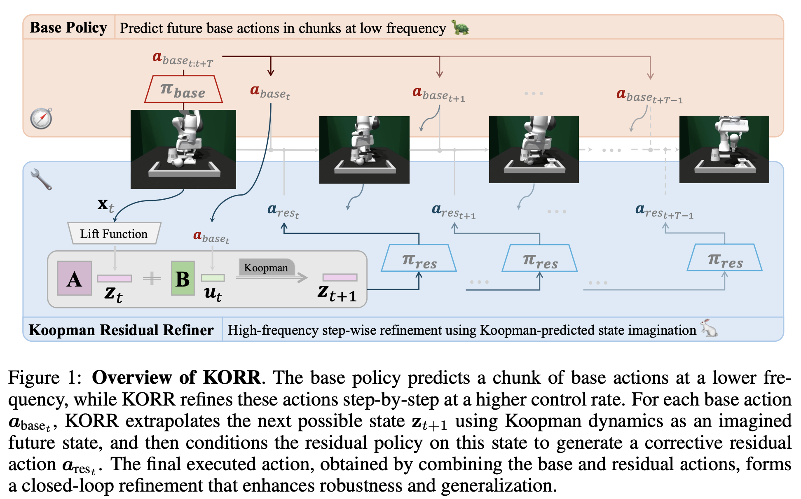

<div align="center">

<h1> 
Robust Online Residual Refinement <br>
via Koopman-Guided Dynamics Modeling
</h1>

<h4 align="center"> 
<a href='https://zhefeigong.github.io/'>Zhefei Gong</a><sup>1</sup>,
<a href='https://scholar.google.com/citations?user=3_DtxJ8AAAAJ'>Shangke Lyu</a><sup>1✉</sup>,
<a href='https://dingpx.github.io/'>Pengxiang Ding</a><sup>12</sup>,
<a href='https://xiaowei-i.github.io/'>Wei Xiao</a><sup>1</sup>,
<a href='https://en.westlake.edu.cn/faculty/donglin-wang.html'>Donglin Wang</a><sup>1✉</sup>
</h4>

<sup>1</sup>Westlake University, <sup>2</sup>Zhejiang University <br>
<sup>✉</sup>Corresponding author.

<a href='https://arxiv.org/abs/2509.12562'></a> 
<a href='https://zhefeigong.github.io/korr-robot/'></a>
<a href='https://huggingface.co/zhefeigong/korr'></a>

</div>


## 👀 Overview

<p align="center">  </p>

> **TL;DR**: introduce **KORR** (**K**oopman-guided **O**nline **R**esidual **R**efinement), a simple yet effective framework that conditions residual corrections on Koopman-predicted latent states, enabling globally informed and stable action refinement.


## 🔧 Install Instructions

#### 1️⃣ Build [miniforge](https://github.com/conda-forge/miniforge#mambaforge) virtual environment

Download and install Miniforge by running:

```bash
curl -L -O "https://github.com/conda-forge/miniforge/releases/latest/download/Miniforge3-$(uname)-$(uname -m).sh"
bash Miniforge3-$(uname)-$(uname -m).sh
```

#### 2️⃣ Create and activate the Conda environment

```bash
conda create -n korr python=3.8 -y
conda activate korr
```

#### 3️⃣ Install [IsaacGym](https://developer.nvidia.com/isaac-gym)

Download the IsaacGym package from the official [website](https://developer.nvidia.com/isaac-gym), or directly from [the AWS S3 mirror](https://iai-robust-rearrangement.s3.us-east-2.amazonaws.com/packages/IsaacGym_Preview_4_Package.tar.gz) for convenience. And you can also refer to the [FurnitureBench installlation instructions](https://clvrai.github.io/furniture-bench/docs/getting_started/installing_furniture_sim.html#download-isaac-gym). 

After downloading, move the archive to your preferred directory and extract it:
```bash
tar -xzf IsaacGym_Preview_4_Package.tar.gz
```

Navigate into the extracted `isaacgym` folder and install the Python bindings:
```bash
pip install -e isaacgym/python --no-cache-dir --force-reinstall
```

The flags `--no-cache-dir` and `--force-reinstall` help ensure a clean installation and prevent conflicts from previous versions.
Note: Ignore any pip upgrade suggestions — the current version is required for compatibility.

#### 4️⃣ Install [Furniture-Bench](https://clvrai.github.io/furniture-bench/)

We use [this fork](https://github.com/ankile/furniture-bench/tree/iros-2024-release-v1) of the original benchmark to simplify installation. Clone it using:
```bash
# # git clone the fork (already cloned under korr/, no need to re-clone:)
# git clone --recursive git@github.com:ankile/furniture-bench.git
# install the FurnitureBench package
cd korr/furniture-bench
pip install -e .
```

To verify the installation, run a simple simulation with:
```bash
python -m furniture_bench.scripts.run_sim_env --furniture one_leg --scripted
```

#### 5️⃣ Install the packages of KORR

```bash
# install through setup.py
pip install -e .
# additional dependencies
pip install -e korr/furniture-bench/r3m
```


## 📊 Dataset
We use a lightweight dataset available [here](https://iai-robust-rearrangement.s3.us-east-2.amazonaws.com/index.html#data/processed/diffik/sim/), which contains 50 demonstrations per task for each level of randomness.

To download the data, run:
```bash
python scripts/download_data.py --task one_leg
python scripts/download_data.py --task lamp
python scripts/download_data.py --task roundd_table
```

The maximum rollout steps for each task are: `one_leg = 700`, `lamp = 1000`, `round_table = 1000`.


## 🏃 Training

#### 1️⃣ Base Policy through Imitation Learning

🏷️ Diffusion Policy (DP)

Implemented based on the official [repository](https://github.com/real-stanford/diffusion_policy).
To train the policy, simply run:
```bash
bash ./scripts/train_dp.sh
```

🏷️ Coarse-to-Fine Autoregressive Policy (CARP)

Implemented based on the official [repository](https://github.com/ZhefeiGong/carp).
Before training the policy, make sure to first train the action tokenizer:
```bash
bash ./scripts/train_carp_vqvae.sh
```

Then, you can start training the policy with:
```bash
bash ./scripts/train_carp.sh
```

#### 2️⃣ Residual Policy through Reinforcement Learning

This is the core of our framework—residual policy training with online reinforcement learning. 
You can train the residual policy on top of different base policies with the following commands:

🏷️ Legacy Method: ResiP ([paper](https://arxiv.org/pdf/2407.16677))

```bash
# With Diffusion Policy as base policy:
bash ./scripts/train_rl_resip_dp.sh

# With CARP as base policy:
bash ./scripts/train_rl_resip_carp.sh
```

🏷️ Our Method: KORR (Koopman-based Online Residual Reinforcement)

```bash
# With Diffusion Policy as base policy:
bash ./scripts/train_rl_korr_dp.sh

# With CARP as base policy:
bash ./scripts/train_rl_korr_carp.sh
```


## 💻 Evaluation
To evaluate the full policy (base + residual), run the following scripts based on your base policy:
```bash
# evaluate with diffusion policy as base policy
bash ./scripts/eval_residual_dp.sh

# evaluate with coarse-to-fine autoregressive policy as base policy
bash ./scripts/eval_residual_carp.sh
```


## 🧮 Furthermore
If you'd like to try the goal-conditioned version of the residual policy described in our paper, start by generating the goal observations for each task using `./src/koopman/misc/kpm_goal_gen.py`.
Then, for each residual policy training script, simply specify the goal path via `actor.residual_policy.g_goal_path=/path/to/your/goal_obs.pkl`,
and update the class target (e.g., `actor.residual_policy._target_`) as shown in the corresponding bash script.
This will enable training of the goal-conditioned residual policy.


## 🤔 Troubleshooting
* `ImportError: libpython3.8.so.1.0: cannot open shared object file: No such file or directory` 

    This can usually be fixed by adding your Conda environment's library path to LD_LIBRARY_PATH:
    ```bash
    export LD_LIBRARY_PATH=YOUR_CONDA_PATH/envs/YOUR_CONDA_ENV_NAME/lib
    ```
* `[Error] [carb.gym.plugin] cudaImportExternalMemory failed on rgbImage buffer with error 999`

    If you're using an NVIDIA GTX 3070, try setting:
    ```bash
    export VK_ICD_FILENAMES=/usr/share/vulkan/icd.d/nvidia_icd.json
    ```
    You can find more information about this issue [here](https://forums.developer.nvidia.com/t/cudaimportexternalmemory-failed-on-rgbimage/212944/4).


## 🙏 Acknowledgment
We sincerely thank the authors of [Furniture-Bench](https://github.com/clvrai/furniture-bench) for providing a high-quality benchmark environment, and appreciate the insightful preliminary exploration of residual policy learning in [From Imitation to Refinement](https://github.com/ankile/robust-rearrangement/tree/main), which inspired part of our work.


## 🏷️ License
This repository is licensed under the MIT License. See the [LICENSE](./LICENSE) file for more details.


## 📌 Citation
If you find our work useful, please consider citing the following paper:
```bibtex
@misc{gong2025robustonlineresidualrefinement,
      title={Robust Online Residual Refinement via Koopman-Guided Dynamics Modeling}, 
      author={Zhefei Gong and Shangke Lyu and Pengxiang Ding and Wei Xiao and Donglin Wang},
      year={2025},
      eprint={2509.12562},
      archivePrefix={arXiv},
      primaryClass={cs.RO},
      url={https://arxiv.org/abs/2509.12562}, 
}
```

